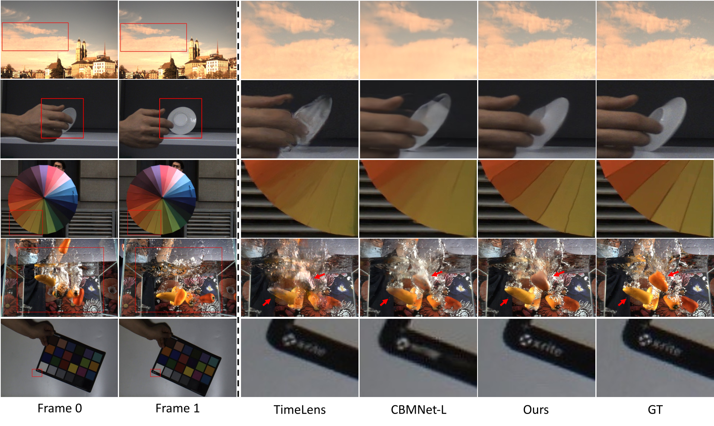

# Video Frame Interpolation via Asymmetric Refinement with the Event-based Reference

[](LICENSE)

<p align="center">
  
</p>

> **Abstract:** 

This is the official PyTorch implementation for our paper **"Video Frame Interpolation via Asymmetric Refinement with the Event-based Reference"**. We introduce DSER++, a novel approach for event-based video frame interpolation.

## 🛠️ Quick Start

### 1. Environment Setup
We recommend using [Anaconda](https://www.anaconda.com/) to manage the python environment.

```bash
# Clone the repository
git clone [https://github.com/your_username/DSER_PlusPlus.git](https://github.com/your_username/DSER_PlusPlus.git)
cd DSER_PlusPlus

# Install dependencies
pip install -r requirements.txt
```

### 2. Data Preparation
Please download the supported datasets.

| Dataset | Type | Source | Note |
| :--- | :---: | :--- | :--- |
| **Vimeo90k** | Synthetic | [Link](http://toflow.csail.mit.edu/) | Simulated using [v2e](https://github.com/SensorsINI/v2e) |
| **GOPRO** | Synthetic | [Link](https://seungjunnah.github.io/Datasets/gopro) | Simulated using [v2e](https://github.com/SensorsINI/v2e) |
| **SNU-FILM** | Synthetic | [Link](https://github.com/myungsub/CAIN) | Simulated using [v2e](https://github.com/SensorsINI/v2e) |
| **HSERGB** | Real | [Link](https://github.com/r00tman/HSERGB) | - |
| **BSERGB** | Real | [Link](https://github.com/uzh-rpg/timelens-pp/?tab=readme-ov-file) | - |
| **EventAid-F**| Real | [Link](https://sites.google.com/view/EventAid-benchmark) | - |

> **Note:** For synthetic datasets (Vimeo90k, GOPRO, SNU-FILM), we synthesize event streams based on the [v2e](https://github.com/SensorsINI/v2e) tool.

### 3. Model Zoo
You can download our pretrained checkpoints from Google Drive:

- [**Download Checkpoints**](https://drive.google.com/drive/folders/1Ixhmixa3yMU-2AN3RF5oan5ddNL3Nnko)

Please place the downloaded weights in the `checkpoints/` directory.

## 🚀 Usage

### Inference

Please refer to interpolation.py

### BS-ERGB training / fine-tuning

The training split is expected to contain one directory per scene:

    3_TRAINING/
      scene_name/
        images/*.png
        events/*.npz

Each event file must contain the BS-ERGB fields x, y, timestamp, and polarity.
A skip-3 window is expanded into the three target triplets (i, i+1, i+4),
(i, i+2, i+4), and (i, i+3, i+4).

Start training from scratch:

    python train_bsergb.py --data-root /path/to/BSERGB/3_TRAINING

Fine-tune a released checkpoint:

    python train_bsergb.py \
      --data-root /path/to/BSERGB/3_TRAINING \
      --pretrained checkpoints/bsergb_eventaid.pth

Resume a checkpoint produced by the training script:

    python train_bsergb.py \
      --data-root /path/to/BSERGB/3_TRAINING \
      --resume train/bsergb/last.pth

The defaults follow the paper where they are available: skips 1 and 3, eight
event bins per temporal segment, 256x256 crops, AdamW, 40 epochs, and cosine
learning-rate decay from 1e-4 to 1e-6. Use the --help option for all settings.

## Citation
If you find this code or paper useful for your research, please cite:

```bibtex
@article{your_name2025dser,
  title={Video Frame Interpolation via Asymmetric Refinement with the Event-based Reference},
  author={Yuhan Liu, Yongjian Deng, Linghui Fu, Hao Chen, Gengyu Lyu, Zhen Yang, Youfu Li, Boxin Shi},
  year={2025}
}
```

## Acknowledgements
The event simulation uses [v2e](https://github.com/SensorsINI/v2e).
